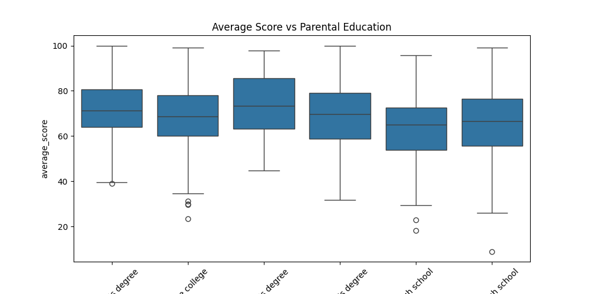
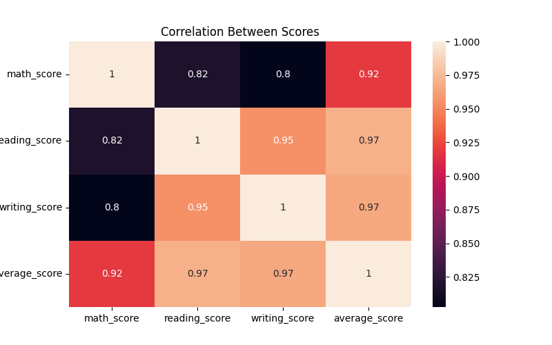
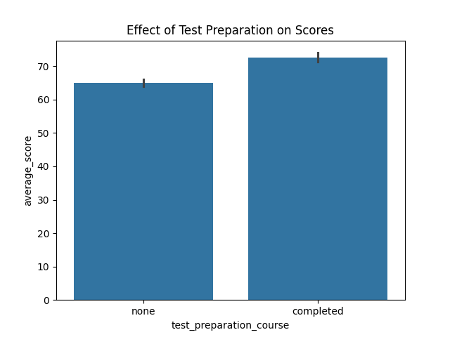

# 🧠 Student Performance Data Analysis

A data analytics project using the Kaggle dataset: [Student Performance in Exams](https://www.kaggle.com/datasets/spscientist/students-performance-in-exams)

## 📊 Project Overview

This project explores academic performance trends using Python and data visualization libraries. It aims to understand how gender, parental education, and test preparation affect students’ exam scores.

## 🛠️ Tools Used

- Python
- Pandas
- Seaborn
- Matplotlib

## 📁 What’s Inside

- `student_analysis.ipynb` – Jupyter notebook with full analysis
- Visuals: heatmaps, bar charts, boxplots
- Cleaned and processed dataset
- Insights into score distribution, correlation, and trends

## 📷 Sample Visualizations

### 📦 Average Score by Parental Education  

### 🔥 Correlation Heatmap  

### 📘 Test Preparation Effect  

## 📌 How to Run

1. Clone the repo  
2. Open the notebook in Jupyter or Google Colab  
3. Run all cells

---

## 🙌 Credits

Dataset: [Kaggle - Student Performance in Exams](https://www.kaggle.com/datasets/spscientist/students-performance-in-exams)
